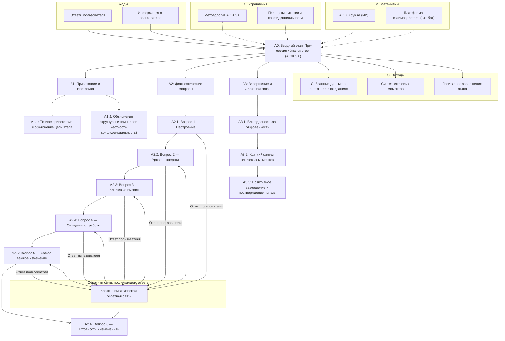

# IDEF0-схема этапа "Пре-сессия / Знакомство" (АОЖ 3.0)

## Описание этапа

Вводный этап "Пре-сессия / Знакомство" по системе "Архитектура Осмысленной Жизни 3.0" (АОЖ 3.0) предназначен для установления контакта, диагностики текущего состояния пользователя и формирования базы для дальнейшей работы. Этап реализуется через последовательный диалог с ИИ-коучем, который задаёт вопросы по одному, дожидается ответа и даёт краткую эмпатическую обратную связь.

## IDEF0-структура

## Краткое текстовое описание блоков

- **A1: Приветствие и настройка** — ИИ приветствует пользователя, объясняет цель этапа, рассказывает о принципах честности и конфиденциальности.
- **A2: Диагностические вопросы** — ИИ задаёт вопросы по одному, после каждого ответа даёт краткую эмпатическую обратную связь.
- **A3: Завершение и обратная связь** — благодарность за откровенность, синтез ключевых моментов, позитивное завершение.

### IDEF0-элементы:
- **Входы (Inputs):** ответы пользователя, информация о пользователе.
- **Управления (Controls):** методология АОЖ 3.0, принципы эмпатии и конфиденциальности.
- **Механизмы (Mechanisms):** ИИ-коуч (АОЖ-Коуч AI), платформа взаимодействия (чат-бот).
- **Выходы (Outputs):** собранные данные о состоянии и ожиданиях, синтез ключевых моментов, позитивное завершение этапа. 