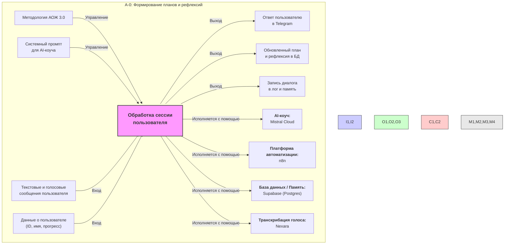

# IDEF0-схема процесса "Формирование планов и рефлексий"

Эта диаграмма описывает высокоуровневую архитектуру системы "Архитектура Осмысленной Жизни 3.0", показывая ключевые входы, выходы, элементы управления и механизмы.

## Компоненты диаграммы

### Входы (Inputs)
- **Сообщения пользователя:** Текст или голос, который отправляет пользователь.
- **Данные о пользователе:** Информация из базы данных (ID, имя, текущий прогресс в сессии).

### Выходы (Outputs)
- **Ответ пользователю в Telegram:** Сгенерированное AI-коучем сообщение.
- **Обновленный план и рефлексия в БД:** Структурированные результаты сессии, сохраненные в Supabase.
- **Запись диалога в лог и память:** Сохранение истории сообщений для контекста и анализа.

### Управление (Controls)
- **Методология АОЖ 3.0:** Принципы и структура коучинговой сессии.
- **Системный промпт для AI-коуча:** Конкретные инструкции, которые определяют поведение AI.

### Механизмы (Mechanisms)
- **AI-коуч (Mistral Cloud):** Языковая модель, генерирующая ответы.
- **Платформа автоматизации (n8n):** Система, управляющая всем процессом.
- **База данных / Память (Supabase):** Хранилище для всех данных пользователя.
- **Транскрибация голоса (Nexara):** Сервис для преобразования голоса в текст. 