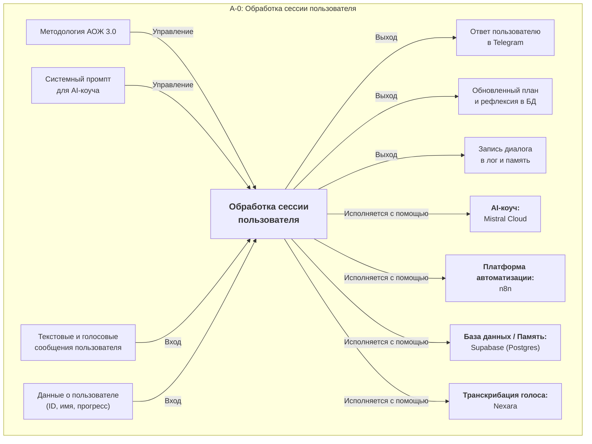
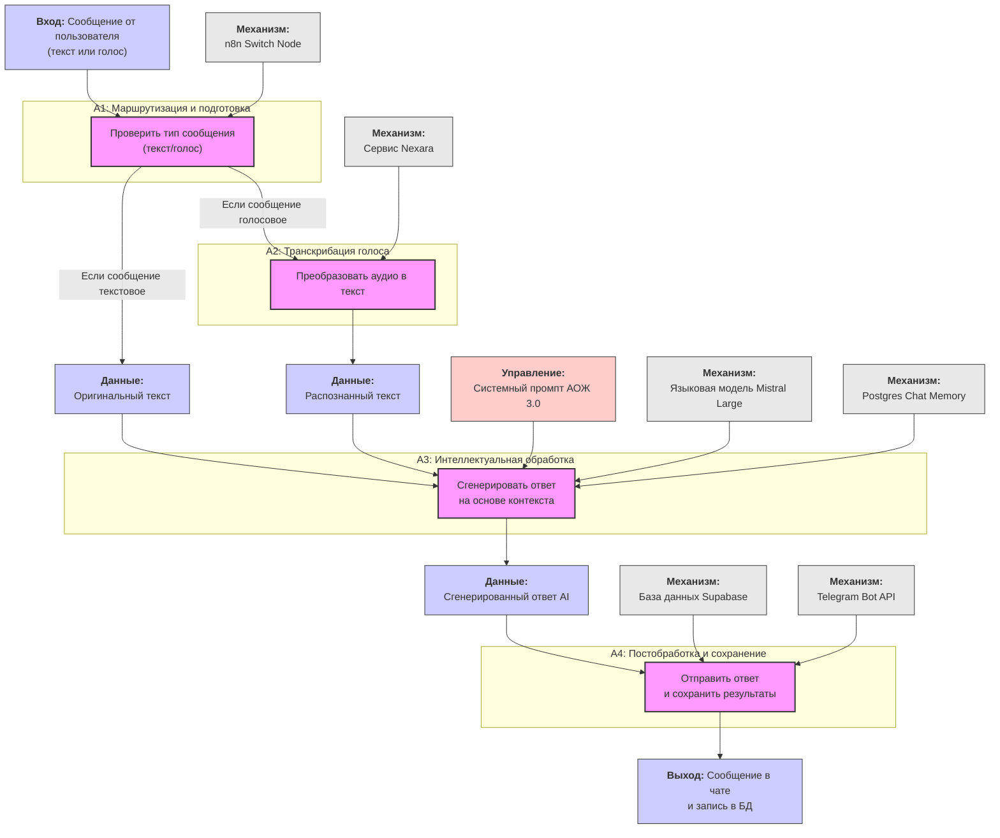

# Система "Архитектура Осмысленной Жизни 3.0": Полная архитектура

Этот документ описывает полную архитектуру системы АОЖ 3.0 на трех уровнях детализации, соответствующих методологии IDEF0.

---

## Уровень 1: Контекстная диаграмма (A-0)

Эта диаграмма представляет всю систему как единый "черный ящик", показывая ее основные входы, выходы, элементы управления и механизмы. Это взгляд на систему с высоты птичьего полета.



---

## Уровень 2: Декомпозиция по этапам АОЖ 3.0 (A0)

Эта диаграмма "раскрывает" центральный блок из предыдущей схемы и показывает, из каких логических этапов состоит сессия с пользователем, согласно вашему документу `AOJ3.md`.

```mermaid
graph TD
    subgraph A0_Decomposition [A0: Этапы сессии "Пре-сессия и Знакомство"]
        %% Process Blocks from AOJ3.md
        A1["<b>A1: Приветствие<br/>и Настройка</b>"]
        A2["<b>A2: Диагностика</b><br/>(вопросы о настроении,<br/>энергии, вызовах и т.д.)"]
        A3["<b>A3: Синтез<br/>и Завершение</b>"]

        %% Connections
        A1 -- "Начало диалога" --> A2
        A2 -- "Ответы пользователя" --> A3

        %% Inputs
        I1["Сообщения и данные<br/>пользователя"]
        I1 -- Вход --> A1 & A2
        
        %% Outputs
        O1["Эмпатичные ответы<br/>и следующие вопросы"]
        O2["Итоговый синтез в БД<br/>и ответ пользователю"]
        
        A2 -- Выход --> O1
        A3 -- Выход --> O2

        %% Controls
        C1["Методология из AOJ3.md"]
        C1 -- Управляет --> A1 & A2 & A3
        
        %% Mechanisms
        M_All["<div style='text-align:center'><b>Общие механизмы:</b><br/>AI-коуч, n8n, Supabase, Nexara</div>"]
        M_All -- "Используются" --> A1 & A2 & A3
    end
```

---

## Уровень 3: Детализированная пошаговая схема

Эта диаграмма показывает фактический технический процесс обработки каждого сообщения пользователя, от получения до отправки ответа.

